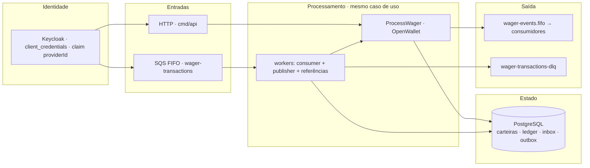

# Jungle Platform — Visão Geral do Projeto

Serviço em Go que processa operações de apostas (`BET`, `WIN`, `LOSS`, `REFUND`, `ROLLBACK`) contra carteiras de jogadores com dinheiro exato (sem ponto flutuante), idempotência persistente, ledger append-only, outbox transacional e consumidor SQS com múltiplas instâncias em execução e falhas entre quaisquer duas etapas do processamento.

## Visão da arquitetura



Três entrypoints:

| Entrypoint | Papel |
| --- | --- |
| `cmd/api` | API HTTP: carteiras, transações de apostas, leituras, reconciliação, health checks e métricas |
| `cmd/worker` | Consumidor SQS (inbox transacional), publisher da outbox (`FOR UPDATE SKIP LOCKED`), worker de referências pendentes |
| `cmd/migrations` | Migrations versionadas (up/down), SQL embutido no binário |

## Pré-requisitos

- Docker + Docker Compose
- Go 1.26 (declarado no `go.mod` e nos Dockerfiles)
- Shell POSIX para os comandos auxiliares abaixo

## Início rápido

```sh
docker compose up --build
```

Sobe PostgreSQL 17, Keycloak 26 (com o realm `jungle`, clients `internal`, `provider-a`, `provider-b` e o claim `providerId`), LocalStack (filas SQS FIFO incluindo DLQ e fila de eventos), aplica as migrations e executa `api` + `worker`.

**Teste rápido (a partir de um stack limpo):**

```sh
# token do serviço interno
TOKEN=$(curl -s -X POST http://localhost:8180/realms/jungle/protocol/openid-connect/token \
  -d "grant_type=client_credentials&client_id=internal&client_secret=internal-secret" \
  | python -c "import sys,json;print(json.load(sys.stdin)['access_token'])")

# abrir uma carteira
curl -s -X POST http://localhost:8080/wallets \
  -H "Authorization: Bearer $TOKEN" -H "Content-Type: application/json" \
  -d '{"playerId":"0199f28f-5dc0-7d58-bdb2-814ad6a0f4a1","initialBalance":{"amount":"1000.00","currency":"BRL"}}'
```

Chamada como provedor (só vê as próprias transações; o `providerId` vem do token):

```sh
PTOKEN=$(curl -s -X POST http://localhost:8180/realms/jungle/protocol/openid-connect/token \
  -d "grant_type=client_credentials&client_id=provider-a&client_secret=provider-a-secret" \
  | python -c "import sys,json;print(json.load(sys.stdin)['access_token'])")

curl -s -X POST http://localhost:8080/wagering/transactions \
  -H "Authorization: Bearer $PTOKEN" -H "Content-Type: application/json" \
  -H "Idempotency-Key: provider-a:transaction-123" \
  -d '{"providerId":"provider-a","externalTransactionId":"transaction-123","playerId":"...","walletId":"...","roundId":"round-987","gameId":"fortune-chimp","kind":"BET","money":{"amount":"25.00","currency":"BRL"}}'
```

## Variáveis de ambiente

Veja `.env.example`. Destaques:

| Variável | Significado |
| --- | --- |
| `HTTP_ADDR` | Endereço de escuta da API (`:8080`) |
| `POSTGRES_DSN` | DSN do banco |
| `SQS_ENDPOINT` | Endpoint do LocalStack (vazio para AWS real) |
| `SQS_QUEUE_URL` / `SQS_DLQ_URL` / `EVENTS_QUEUE_URL` | Filas |
| `KEYCLOAK_ISSUER_URL` | Issuer validado nos tokens (fixado pelo `frontendUrl` do realm) |
| `KEYCLOAK_JWKS_URL` | JWKS explícito quando o host do issuer não é alcançável pelo processo |
| `PENDING_REF_TTL` | Tempo máximo de espera de uma referência pendente (default `24h`) |
| `SHUTDOWN_GRACE` | Janela de shutdown gracioso (default `5s`) |

## Migrations

```sh
# up (também roda automaticamente no docker compose)
go run ./cmd/migrations
# down (reverte tudo):
go run ./cmd/migrations -direction down
```

As migrations ficam em `db/migrations` e são embutidas no binário (`db/migrations/embed.go`).

## Testes

```sh
# testes unitários (sem containers)
go test ./...

# race detector (o host precisa de gcc; ou use o comando em container abaixo)
go test -race ./...

# testes de integração: PostgreSQL, Keycloak e LocalStack reais
docker compose up -d postgres keycloak localstack
go test -tags integration -count=1 -p 1 ./internal/... ./tests/...

# tudo, com race, dentro do container da toolchain oficial
docker run --rm -v "$PWD":/src -w /src -e GOCACHE=/tmp/gocache \
  golang:1.26 go test -race -tags integration -p 1 ./internal/... ./tests/...

go vet ./...
gofmt -l .
```

`-p 1` serializa os pacotes: as suítes de integração compartilham o banco `jungle_test` (os dados de desenvolvimento em `jungle` nunca são tocados; veja `TEST_POSTGRES_DSN`).

Cobertura de integração (destaques): constraints do schema (saldo negativo, unicidade, ledger append-only), idempotência (replay por chave+hash, conflito, reuso de `(providerId, externalTransactionId)`), reentrega na inbox, disputa da outbox entre dois publishers, redrive (migração para a DLQ após esgotar as reentregas), referências pendentes (resolução, expiração por TTL, bloqueio de dupla reversão) e os cenários obrigatórios do §13 (duas apostas de 80.00 sobre 100.00 em três instâncias, 50 replays paralelos, carteiras paralelas, reinício) — tudo também executado com `-race` via comando em container.

## Múltiplas instâncias e simulações de falha

```sh
# três instâncias independentes da API sobre o mesmo banco (a API do compose
# continua na :8080; estas duas acrescentam a segunda e a terceira)
HTTP_ADDR=:8081 go run ./cmd/api &
HTTP_ADDR=:8082 go run ./cmd/api &

# três workers independentes (a deduplicação da inbox vive no PostgreSQL, então
# vale entre todas as instâncias; o worker do compose também continua rodando)
go run ./cmd/worker &
go run ./cmd/worker &

# simulações de falha:
# - matar entre commit e remoção da mensagem: ela volta a ficar visível na fila
#   e é reentregue; o registro da inbox no banco impede um movimento duplicado
# - matar entre commit e publicação: o publisher de outra instância reivindica
#   o evento na outbox depois que a lease expira, preservando o eventId
```

## Observabilidade

- `GET /health/live`, `GET /health/ready` (PostgreSQL + SQS)
- `GET /metrics` (Prometheus): `wager_transactions_total{status}`, `duplicates_total`, `idempotency_conflicts_total`, `retries_total`, `dlq_total`, `outbox_pending`, `processing_duration_seconds`, `reconciliation_divergences_total`
- Logs JSON estruturados com `correlationId`, `messageId`, `transactionId`, `walletId`, `providerId` — nunca credenciais nem payloads financeiros completos

## Contrato HTTP

| Método | Caminho | Auth | Observações |
| --- | --- | --- | --- |
| `POST /wallets` | apenas `internal` | 201 criada; 409 duplicata `(playerId, currency)`; saldo zero não cria registros financeiros |
| `GET /wallets/:id` | apenas `internal` | estado da carteira |
| `GET /wallets/:id/ledger?cursor=&limit=` | apenas `internal` | cursor opaco, ordenação estável `(created_at, id)` |
| `POST /wallets/:id/reconciliation` | apenas `internal` | comparação com o ledger, sem corrigir |
| `POST /wagering/transactions` | provider/internal | `Idempotency-Key` obrigatória; 200 processado/replay, 202 referência pendente, 400 entrada inválida, 404 carteira não encontrada, 409 conflito, 422 rejeição de negócio (`failureCode`), 503 falha transitória |
| `GET /wagering/transactions/:id` | isolamento por provedor | provedor vê só o seu |
| `GET /providers/:providerId/wagering/transactions/:externalTransactionId` | isolamento por provedor | |
| `GET /health/live` / `GET /health/ready` / `GET /metrics` | público | |

## Estrutura do projeto

```
cmd/api|worker|migrations      entrypoints (Uber Fx)
internal/domain                domínio puro: Money, Wallet, WagerTransaction, LedgerEntry, eventos, portas
internal/repository/postgres   repositórios pgx, TxManager, SQL explícito
internal/usecase               OpenWallet, ProcessWager (HTTP+SQS), Reconcile, hash de payload
internal/transport/httpapi     handlers chi, DTOs, mapeamento erro→status
internal/transport/sqsconsumer consumidor SQS com inbox transacional
internal/outbox                publisher concorrente da outbox
internal/pendingref            worker de resolução de referências
internal/platform              config, logger, auth (JWKS), métricas, middleware, httpserver, migrate
db/migrations                  SQL versionado + embed
tests/concurrency              cenários obrigatórios do §13
```

## Decisões de arquitetura

Veja `ARCHITECTURE.md` para as decisões documentadas sobre representação de dinheiro, fronteiras de transação, idempotência, locking, referências, reversões, inbox/outbox, autenticação, composição Fx e shutdown, além das limitações conhecidas.

## Usando a API via Postman

A pasta `docs/postman/` traz tudo pronto para testar a API manualmente:

- **`jungle-platform.postman_collection.json`** — collection com todas as rotas (health/metrics, carteiras, operações de apostas, consultas, reconciliação) e autenticação OAuth2 `client_credentials` pré-configurada por identidade (`internal`, `provider-a`, `provider-b`). Os scripts de teste encadeiam automaticamente os ids entre as chamadas (`walletId`, `transactionId`, `externalTransactionId`).
- **`SEQUENCE.md`** — guia passo a passo em português que percorre **o ciclo de vida completo de uma operação financeira**: da obtenção do token no Keycloak até a reconciliação final, passando por idempotência na prática (replay e conflito), regras dos cinco tipos de operação, reversões com deduplicação, referência pendente resolvida por outro processo, isolamento entre provedores, o caminho assíncrono via SQS e a observabilidade de tudo.

**Para começar:**

1. Importe a collection no Postman (*File → Import*).
2. Garanta o ambiente de pé (`docker compose up --build`).
3. Siga o guia `docs/postman/SEQUENCE.md` na ordem — cada fase explica o que o endpoint faz internamente, o que esperar na resposta e quais campos alimentam o próximo passo.
